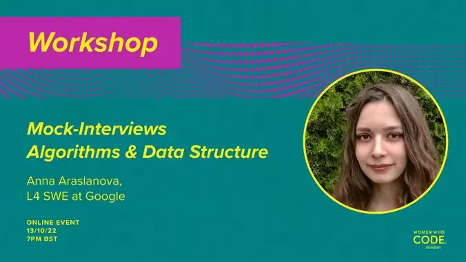
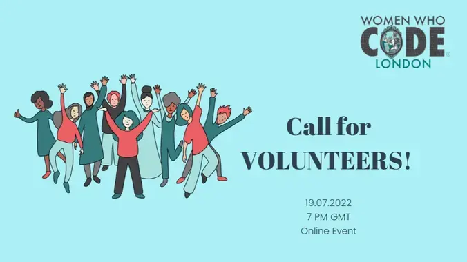

  &nbsp;&nbsp;&nbsp; 

- [Women Who Code London - Network](#women-who-code-london---network)
- [Social](#social)
- [Educational Programmes](#educational-programmes)
- [Event Resources](#event-resources)
    - [Recent events:](#recent-events)
- [About Women Who Code](#about-women-who-code)
- [Code of Conduct](#code-of-conduct)
- [Contributing](#contributing)
- [Community](#community)
  - [Programmes](#programmes)
  - [Special Interest Groups](#special-interest-groups)
  - [Other Volunteering Opportunities](#other-volunteering-opportunities)
- [Credits](#credits)

Women Who Code London - Network
---
Welcome! This repo contains content, code & resources for the Women Who Code London network.

The Women Who Code London is a community dedicated to inspiring women to excel in their technology careers. Our events cover various topics around software engineering.

💻 Technical Webinars 📲 Coding Resources 💭 Study Group Sessions 🗺️ Supportive Global Network

**If you're interested in joining the community as a member or volunteer please visit our [website](https://www.womenwhocode.com/london) for more information.**

## Social

Join our community conversations!

- [Slack](https://join.slack.com/t/wwcodelondon/shared_invite/enQtNjgwNjc4Nzk1MTQxLTU0NjkwMDBkYWIwZjVmYzBjZDkzMzJiM2YyYzU1ODdhZDM3YzU2ZjMyNzE4NWZhNTE0YTRlZGU5NmI1NTkwMDY)  
- [Twitter](https://twitter.com/WWCodeLondon)  
- [Facebook](https://www.facebook.com/wwcodelondon/)
- [LinkedIn](https://www.linkedin.com/company/wwcodelondon/)
- [Meetup](https://www.meetup.com/women-who-code-london/)

## Educational Programmes
 

Since Covid-19, WWCode London developed three fantastic programmes to help you learn on-line and for free!

<table style= "background-color: transparent; border-color: transparent;">
<tbody>
<tr>
  <th>Programme</th> <th>Session</th> <th>Speaker(s)</th>
</tr>

<!-- Algo&Data Structure -->
<tr>
  <th rowspan="12" align="left">

  [Algorithms & Data Structure](https://www.youtube.com/watch?v=6XVZvDy49bE&list=PLVcEZG2JPVhdzf4cgDxH2TK4U1uEfaF8E)</th>

  <td>

  [Data Structures 101](https://www.youtube.com/watch?v=6XVZvDy49bE&list=PLVcEZG2JPVhdzf4cgDxH2TK4U1uEfaF8E&index=1)</td>

  <td>

  [Abhipsa Mishra](https://www.linkedin.com/in/abhipsa-mishra-684a4326/?originalSubdomain=uk)</td>
</tr>

<tr>
<td>

[Understanding Algorithmic Complexity. Big O Notation](https://www.youtube.com/watch?v=Qbb57_HIjqk&list=PLVcEZG2JPVhdzf4cgDxH2TK4U1uEfaF8E&index=2)</td>
<td>

[Irina Kamalova](https://www.linkedin.com/in/irina-kamalova/)</td>
</tr>

<tr>
<td>

[Arrays, Linked Lists and Hash Tables](https://www.youtube.com/watch?v=qug9R7TYuKw&list=PLVcEZG2JPVhdzf4cgDxH2TK4U1uEfaF8E&index=3)</td>
<td>

[Jade Gordon](https://www.linkedin.com/in/jade-gordon/)</td>
</tr>

<tr>
<td>

[Queues and Stacks](https://www.youtube.com/watch?v=L4o4dToADgE&list=PLVcEZG2JPVhdzf4cgDxH2TK4U1uEfaF8E&index=4)</td>
<td>

[Arai Sabyrzhan](https://www.linkedin.com/in/araisabyrzhan/)</td>
</tr>

<tr>
<td>

[Basic Algorithms on Strings](https://www.youtube.com/watch?v=KL7Wlzu_H3U&list=PLVcEZG2JPVhdzf4cgDxH2TK4U1uEfaF8E&index=5)</td>
<td>

[Abhipsa Mishra](https://www.linkedin.com/in/abhipsa-mishra-684a4326/)</td>
</tr>

<tr>
<td>

[Sorting and Searching Algorithms](https://www.youtube.com/watch?v=Tiy9YNvVawc&list=PLVcEZG2JPVhdzf4cgDxH2TK4U1uEfaF8E&index=6)</td>
<td>

[Elena Andreeva](https://www.linkedin.com/in/elena-andreeva-95bba5a0/)</td>
</tr>

<tr>
<td>

[Greedy Algorithms](https://www.youtube.com/watch?v=SDca_Wq8GJQ&list=PLVcEZG2JPVhdzf4cgDxH2TK4U1uEfaF8E&index=7)</td>
<td>

[Jamica Ortiz](https://www.linkedin.com/in/jortizbr/)</td>
</tr>

<tr>
<td>

[Trees and Graphs](https://www.youtube.com/watch?v=zuOtOeEbfgc&list=PLVcEZG2JPVhdzf4cgDxH2TK4U1uEfaF8E&index=8)</td>
<td>

[Alex Mikhailova](https://www.linkedin.com/in/alexmikhailova/)</td>
</tr>

<tr>
<td>

[Recursion vol. 1. Divide-and-conquer and Dynamic Programming](https://www.youtube.com/watch?v=J8HfG7EdPGg&list=PLVcEZG2JPVhdzf4cgDxH2TK4U1uEfaF8E&index=9)</td>
<td>

[Julia Martemyanova](https://www.linkedin.com/in/julia-martemyanova/)</td>
</tr>

<tr>
<td>

[Recursion vol. 2. Dynamic Programming and Memoization](https://www.youtube.com/watch?v=7EP8d_YyXew&list=PLVcEZG2JPVhdzf4cgDxH2TK4U1uEfaF8E&index=10)</td>
<td>

[Irina Kamalova](https://www.linkedin.com/in/irina-kamalova/)</td>
</tr>

<tr>
<td>

[Sliding Window](https://www.youtube.com/watch?v=WPe8sMF-l9o&list=PLVcEZG2JPVhdzf4cgDxH2TK4U1uEfaF8E&index=11)</td>
<td>

[Sarah Nicole Usher](https://www.linkedin.com/in/sarah-nicole-usher/)</td>
</tr>

<tr>
<td>

[Panel Discussion "Interview Tips and Tricks"](https://www.youtube.com/watch?v=xP42EGzNb2w&list=PLVcEZG2JPVhdzf4cgDxH2TK4U1uEfaF8E&index=12)</td>
<td>

 ✪ [Jamica Ortiz](https://www.linkedin.com/in/jortizbr/)

 ✪ [Abhipsa Mishra](https://www.linkedin.com/in/abhipsa-mishra-684a4326/)

 ✪ [Arai Sabyrzhan](https://www.linkedin.com/in/araisabyrzhan/)

 ✪ [Irina Kamalova](https://www.linkedin.com/in/irina-kamalova/)</td>
</tr>

<!-- Object Oriented Programming -->

<tr>
  <th rowspan="4" align="left">

  [Object Oriented Programming](https://www.youtube.com/watch?v=NK-wieGZRkg&list=PLVcEZG2JPVhfpkAzOQ1ygRNu23A2wcPm7)</th>
  <td>

  [Introduction](https://www.youtube.com/watch?v=NK-wieGZRkg&list=PLVcEZG2JPVhfpkAzOQ1ygRNu23A2wcPm7)</td>
  <td>

  [Jamica Ortiz](https://www.linkedin.com/in/jortizbr/)</td>
</tr>

<tr>
<td>

[SOLID principles](https://www.youtube.com/watch?v=erPk8Y5nw6k&list=PLVcEZG2JPVhfpkAzOQ1ygRNu23A2wcPm7&index=2)</td>
<td>

[Nadia Zhuk](https://www.linkedin.com/in/beetlehope/)</td>
</tr>

<tr>
<td>

[Creational Patterns](https://www.youtube.com/watch?v=QK3DQ1q9lSE&list=PLVcEZG2JPVhfpkAzOQ1ygRNu23A2wcPm7&index=3)</td>
<td>

[Abhipsa Mishra](https://www.linkedin.com/in/abhipsa-mishra-684a4326/)</td>
</tr>

<tr>
<td>

[Behavioural Patterns](https://www.youtube.com/watch?v=6nTnsoW12lY&list=PLVcEZG2JPVhfpkAzOQ1ygRNu23A2wcPm7&index=4)</td>
<td>

[Irina Kamalova](https://www.linkedin.com/in/irina-kamalova/)</td>
</tr>

<!-- Machine Learning 101 -->

<tr>
  <th rowspan="4" align="left">

  [Machine Learning 101](https://www.youtube.com/playlist?list=PLVcEZG2JPVhfn19IBC1ZVQHa-JEUxdMDh)</th>
  <td>

  [Intro](https://www.youtube.com/watch?v=9ODDCa5Ukr4&list=PLVcEZG2JPVhfn19IBC1ZVQHa-JEUxdMDh&index=1)</td>
  <td rowspan="4">

  [Ying Liu](https://www.linkedin.com/in/yingliu-data/)</td>
</tr>

<tr>
<td>

[Setup and Popular Tools](https://www.youtube.com/watch?v=pVzwWe9pKfA&list=PLVcEZG2JPVhfn19IBC1ZVQHa-JEUxdMDh&index=4)</td>
</tr>

<tr>
<td>

[Algorithms](https://www.youtube.com/watch?v=NBkNI1WgW3A&list=PLVcEZG2JPVhfn19IBC1ZVQHa-JEUxdMDh&index=3)</td>
</tr>

<tr>
<td>

[Naïve Bayes](https://www.youtube.com/watch?v=iV_r30gcrDw&list=PLVcEZG2JPVhfn19IBC1ZVQHa-JEUxdMDh&index=2)</td>
</tr>

</tbody>
</table>
 

## Event Resources

See below to find all the resources shared during past and upcoming events. You will also find a link to resources related to the event. All recorded events are uploaded to the [Women Who Code Youtube Channel](https://www.youtube.com/channel/UCfMEaBUSABoOsxr7HgSmEdA) 1-3 days following an event. Please note all events are not recorded. Please reach out with any questions or issues, or join us in our Slack channel for interactive discussions and support.

To add new resources for events follow the [CONTRIBUTING guidelines](CONTRIBUTING.md).

#### Recent events:

<table style= "background-color: transparent; border-color: transparent;">
<tbody>

<!-- Mock-Interviews: Algorithms & Data Structure -->
<tr>
<td style="1px solid black" align="left" width="20%">&nbsp;</td>
<td colspan="3"><b>Workshop Mock-Interviews: Algorithms & Data Structure</b>
  
Mock Interviews are very helpful in preparing for real interviews! Women Who Code London helps participants of the community to organise mock interviews and practise tackling interviews with each other!

In this session, we will share the guidelines to go through coding interviews and solving Algorithms and Data Structures problems!

 
<em>- by Anna Araslanova </em>
  

- [Presentation](https://docs.google.com/presentation/d/1-FiCp8KOQCjUmwz05JADm8umNU3TljRTPyAzs70bGJI/)
- [Video Recording](https://www.youtube.com/watch?v=A8AvkOSvUpM)
- [Materials](resources/mock-interviews/mock-coding-interview)
- [Slack #mock_interview](https://wwcodelondon.slack.com/archives/C03LFUH9W3X)

<!-- Mock Behavioral Interview -->
<tr>
<td style="1px solid black" align="left" width="20%">&nbsp;</td>
<td colspan="3"><b>Mock Behavioral Interview</b>
  
Interviewing is a skill that improves with practice. You never want your first interview to be for the job you want the most. In order to ensure you have had some practice before it really counts, Women Who Code London is proud to launch the Mock Behavioral Interview Program for all our members to hone their interviewing skills.
  

A mock interview gives you practice answering interview questions in a realistic setting where you are under a bit of pressure. It’s only about 30 minutes, but that’s enough time to force you to think on your feet. Most important, mock interviews are designed to provide feedback and allow for improvement.

Who is this program for?
- Anyone who is looking for a job and wants to hone their interviewing skills by practicing in a supportive environment
- Anyone who would be willing to help conduct interviews with candidates and provide feedback. Mock Interviews offer an excellent opportunity to highlight your commitment to the community and also train your own interviewer skills. Interviewers will be provided with full support and resources to conduct interviews and provide feedback.

 
<em>- By Bhawana Haritwal </em>
  

  * [Slides & Materials](resources/mock-interviews/mock-behavioral-interview)
  * [Video Recording](https://www.youtube.com/watch?v=nWHQ0g8sorI)    
  * [Slack #mock_interview](https://wwcodelondon.slack.com/archives/C03LFUH9W3X)

<!-- Book Club: Quiet By Susan Cain -->
<tr>
<td style="1px solid black" align="left" width="20%">&nbsp;</td>
<td colspan="3"><b>Book Club: Quiet By Susan Cain</b>
    
For our July Book Club, Women Who Code London will be reading and discussing “Quiet: The Power of Introverts in a World That Can't Stop Talking" by Susan Cain.
  

How can you measure or define someone's personality? One way is to figure out where a person falls on the introvert-extrovert spectrum. Want to know where on the spectrum you are? Come join us at the book club and see how you can learn about:

- Can one be an extroverted introvert and vice versa?
- Why do extroverts often have it easier?
- How can the particular skills of introverts and extroverts be of use to achieve excellence?

<em>- By Sumeyya Javaid and Rajani Rao</em>
* [Blog](https://www.womenwhocode.com/blog/quiet-book-club-wwcode-london)
* [Slack #bookclub](https://wwcodelondon.slack.com/archives/C01RX3S1Z4Z)
</td>

<!-- Volunteering Summit -->
<tr>
<td style="1px solid black" align="left" width="20%">&nbsp;</td>
<td colspan="3"><b>Volunteering Summit</b>
    
We are opening positions to help & grow with Women Who Code!

We are looking for volunteers, and we prepared a detailed and comprehensive guide on how to be involved! In the presentation, we're going to share our new projects! Get the chance to be the first to know about them and contribute to the next step of growing the Women Who Code Community! Dear women, we need you!   
<em>- By Irina Kamalova</em>
* [Blog](https://www.womenwhocode.com/blog/volunteer-for-women-who-code-london)
* [Slack #welcome_volunteers](https://wwcodelondon.slack.com/archives/C03N6PVU2EQ)
</td>
</tr>

</tbody>
</table>

&nbsp;
&nbsp;
&nbsp;

## About Women Who Code

WWCode is the largest and most active community of technical women in the world. We have over 320,000 members in 147 countries & counting. Join our community by visiting [womenwhocode.com](womenwhocode.com) and sign up to become a member.
  

## Code of Conduct

Women Who Code (WWCode) is dedicated to providing an empowering experience for everyone who participates in or supports our community. Our events are intended to inspire women to excel in technology careers, and anyone who is there for this purpose is welcome. Because we value the safety and security of our members and strive to have an inclusive community, we do not tolerate harassment of members or event participants in any form. This Code of Conduct was created to clearly define what we mean by a harassment-free experience, so that our community and those who support it are clear about our intent and have access to procedures for addressing issues, should they arise.
[Code of Conduct](https://www.womenwhocode.com/codeofconduct)
  

## Contributing

We welcome your contributions! :two_hearts: To contribute to this repo, follow the [contributing guidelines](CONTRIBUTING.md)

## Community

### Programmes

The Women Who Code London community successfully runs multiple programs to support our members in their tech journey. Please refer to the current list of programs in our [community guide](community.md).

### Special Interest Groups

If you are interested in a particular area of tech, get in touch with our special interest groups, where you will meet like-minded professionals to access insights and expertise. Please refer to the details in our [community guide](community.md).

### Other Volunteering Opportunities

We are always looking for new volunteers. If you are interested in volunteering for the community, please refer to the available opportunities in the [community guide](community.md).

## Credits

Thank you to our lovely [contributors](https://github.com/WomenWhoCode/WWCode-London/graphs/contributors).

 
