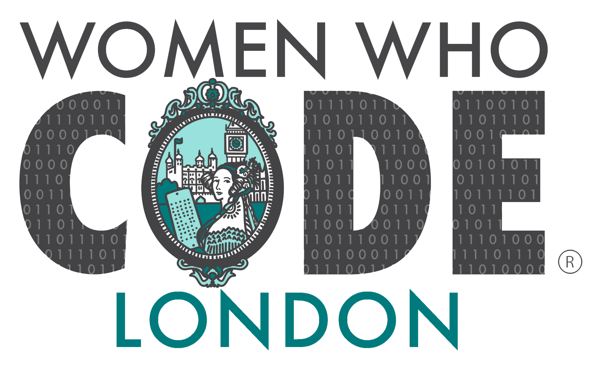

  &nbsp;&nbsp;&nbsp; 

- [Women Who Code London - Network](#women-who-code-london---network)
- [Social](#social)
- [Event Resources](#event-resources)
    - [Recent events:](#recent-events)
- [About Women Who Code](#about-women-who-code)
- [Code of Conduct](#code-of-conduct)
- [Contributing](#contributing)
- [Credits](#credits)

Women Who Code London - Network
---
___
Welcome! This repo contains content, code & resources for the Women Who Code London network.

The Women Who Code London is a community dedicated to inspiring women to excel in their technology careers. Our events cover various topics around software engineering.

💻 Technical Webinars 📲 Coding Resources 💭 Study Group Sessions 🗺️ Supportive Global Network

**If you're interested in joining the community as a member or volunteer please visit our [website](https://www.womenwhocode.com/london) for more information.**
  

## Social
___

Join our community conversations!

[Slack](https://app.slack.com/client/TGYGA50DQ/CGYS4RJE9)  
[Twitter](https://twitter.com/WWCodeLondon)  
[Facebook](https://www.facebook.com/wwcodelondon/)
[LinkedIn](https://www.linkedin.com/company/wwcodelondon/)
  

## Event Resources
___
See below to find all the resources shared during past and upcoming events. Clicking on a logo will take you to the event code base or slides. You will also find a link to the video recording in the event description. All of our events are uploaded to the [Women Who Code Youtube Channel](https://www.youtube.com/channel/UCfMEaBUSABoOsxr7HgSmEdA) 1-3 days following an event. Please reach out with any questions or issues, or join us in our Slack channel for interactive discussions and support.

To add new resources for events follow the [CONTRIBUTING guidelines](CONTRIBUTING.md).
  

#### Recent events:

<table style= "background-color: transparent; border-color: transparent;">
<tbody>

<!-- Book Club: Quiet By Susan Cain -->
<tr>
<td style="1px solid black" align="left" width="20%">&nbsp;</td>
<td colspan="3"><b>Book Club: Quiet By Susan Cain</b>
    
For our July Book Club, Women Who Code London will be reading and discussing “Quiet: The Power of Introverts in a World That Can't Stop Talking" by Susan Cain.
  

How can you measure or define someone's personality? One way is to figure out where a person falls on the introvert-extrovert spectrum. Want to know where on the spectrum you are? Come join us at the book club and see how you can learn about:

- Can one be an extroverted introvert and vice versa?
- Why do extroverts often have it easier?
- How can the particular skills of introverts and extroverts be of use to achieve excellence?
    
<em>- By Sumeyya Javaid and Rajani Rao</em></td>
</tr>

<!-- Volunteering Summit -->
<tr>
<td style="1px solid black" align="left" width="20%">&nbsp;</td>
<td colspan="3"><b>Volunteering Summit</b>
    
We are opening positions to help & grow with Women Who Code!

We are looking for volunteers, and we prepared a detailed and comprehensive guide on how to be involved! In the presentation, we're going to share our new projects! Get the chance to be the first to know about them and contribute to the next step of growing the Women Who Code Community! Dear women, we need you!
    
<em>- By Irina Kamalova</em></td>
</tr>

</tbody>
</table>

&nbsp;
&nbsp;
&nbsp;

## About Women Who Code
___

WWCode is the largest and most active community of technical women in the world. We have over 230,000 members in 70 cities spanning 97 countries & counting. Join our community by visiting [womenwhocode.com](womenwhocode.com) and sign up to become a member.
  

## Code of Conduct
___
Women Who Code (WWCode) is dedicated to providing an empowering experience for everyone who participates in or supports our community. Our events are intended to inspire women to excel in technology careers, and anyone who is there for this purpose is welcome. Because we value the safety and security of our members and strive to have an inclusive community, we do not tolerate harassment of members or event participants in any form. This Code of Conduct was created to clearly define what we mean by a harassment-free experience, so that our community and those who support it are clear about our intent and have access to procedures for addressing issues, should they arise.
[Code of Conduct](https://www.womenwhocode.com/codeofconduct)
  

## Contributing
___
We welcome your contributions! :two_hearts: To contribute to this repo, follow the setup instructions below

1. 🍴 Fork this repo  
2. 🔨 Follow the [contributing guidelines](CONTRIBUTING.md)
3. 🔧 Make a pull request
4. 🎉 Get your pull request approved - success!

Or just [create an issue](https://github.com/WomenWhoCode/WWCode-London/issues) - any little bit of help counts! 😊
  

## Credits
___

Thank you to our lovely [contributors](https://github.com/WomenWhoCode/WWCode-London/graphs/contributors).

 
