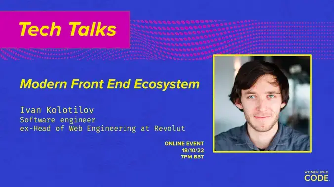

# Front-End Development

## Event Resources

<table style= "background-color: transparent; border-color: transparent;">
<tbody>

<tr>
<td style="1px solid black" align="left">&nbsp</td>

<td colspan="3"><b>

[Modern Front End Ecosystem: Overview & Trends](https://www.youtube.com/watch?v=9jV6URf0I84)</b>
<td>
Software development is an ever-changing craft.

If you're not keeping a close eye on how Front End development evolves, it could sometimes feel crazy how rapidly it changes and quite challenging to wrap your head around.

In this talk, Ivan will guide us through how the modern Front End works, what the journey of the source code from inception to production looks like, what the essential Front End development tools and technologies are, as well as what problems they solve.
In the end, he'll talk about recent Front End development trends and how they may change in the future.

<u>About the Author:</u>
 
Ivan Kolotilov is a Front End developer who spent the last 4 years having fun while developing pretty cool web applications and leading web Front End functions as part of a fantastic team on board a rocket ship known as Revolut.
Joining the fintech space in 2015, he was previously building web apps for financial services, travel and retail.

</tbody>
</table>
 

## Beginner Resources

🚧 This section is currently under construction. Please stay tuned for updates. 🚧
 
 
New to front-end development? Start here.

<table style= "background-color: transparent; border-color: transparent;">
<tbody>

<tr>
<td> Tool
<td>Description
</tr>

<tr>
<td>

[HTML](https://www.w3schools.com/html/default.asp)
<td> Hypertext Markup Language
</tr>

<tr>
<td>

[CSS](https://www.w3schools.com/css/css_intro.asp)

<td> Cascading Style Sheets 
</tr>
</tbody>
</table>
